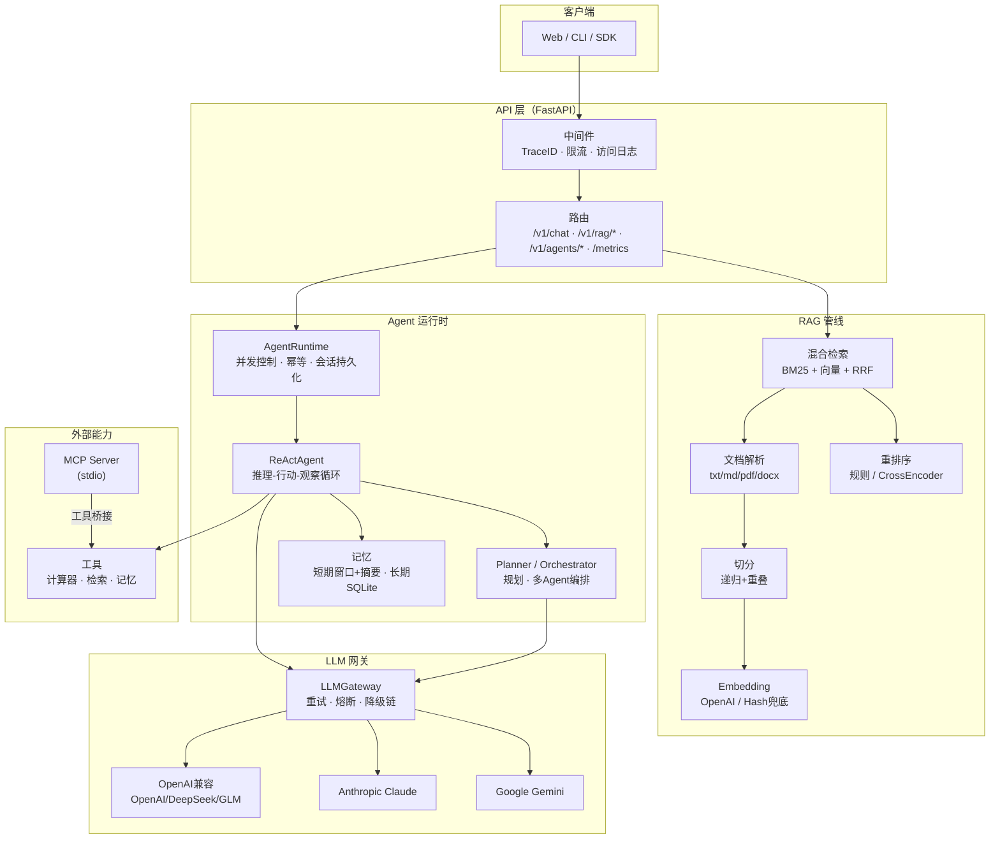

# 架构设计

## 总体架构



## 模块职责

| 模块 | 职责 | 关键文件 |
| --- | --- | --- |
| LLM 网关 | 多协议适配、重试/熔断/降级、结构化输出 | `src/cortex/llm/` |
| RAG 管线 | 解析、切分、向量化、混合检索、重排序 | `src/cortex/rag/` |
| Agent 内核 | ReAct 循环、工具注册、上下文工程 | `src/cortex/agent/react.py` 等 |
| 规划与编排 | 结构化规划、并行研究、Critic 核查 | `src/cortex/agent/planner.py`、`orchestrator.py` |
| 记忆 | 短期窗口/摘要、长期 SQLite + 向量检索 | `src/cortex/agent/memory.py` |
| 运行时 | 会话状态机、并发、幂等、持久化 | `src/cortex/agent/runtime.py` |
| MCP | stdio JSON-RPC 客户端、工具桥接 | `src/cortex/mcp/` |
| API | 路由、中间件、SSE | `src/cortex/api/` |
| 可观测性 | Trace/Span、JSON 日志、Prometheus 指标 | `src/cortex/logging.py`、`metrics.py` |

## 一次请求的完整链路

以"知识库问答"为例：

```
POST /v1/chat {question: "什么是混合检索？"}
  1. RequestContextMiddleware 分配 Trace ID（响应头 X-Request-ID 回传）
  2. RateLimitMiddleware 按客户端 IP 令牌桶限流
  3. ReActAgent 组装上下文（系统提示 + 工具清单 + 记忆 + 问题，Token 预算裁剪）
  4. LLMGateway 调用主模型：
       - 熔断器检查 → 超时/重试（指数退避+抖动）→ 失败降级备用模型
  5. 模型返回 tool_call(rag_search) → 工具执行：
       - 混合检索：Embedding 向量 + BM25 → RRF 融合 → 重排序 → Top-K
       - 结果作为观察回传模型
  6. 模型基于证据生成最终答案（含来源）
  7. 对话写入短期记忆；指标 + Trace 日志落盘
```

## 可靠性设计（详见 docs/DESIGN.md）

- **超时**：httpx 每 Provider 可配超时；MCP 请求级超时；
- **重试**：仅重试可重试错误（429/5xx/超时），指数退避 + 抖动；
- **熔断**：连续失败阈值 → 打开 → 冷却 → 半开探测；
- **降级**：Provider 降级链 + 重排序模型缺失时规则重排兜底 + 离线 HashEmbedder；
- **幂等**：`idempotency_key` 去重，重复提交返回同一会话；
- **并发**：AgentRuntime 信号量限流；编排器 `asyncio.gather` 并行研究；
- **监控**：Prometheus 指标 + 结构化 JSON 日志 + Trace/Span。

## 可替换点（生产扩展方向）

| 组件 | 当前实现 | 生产替换 |
| --- | --- | --- |
| 向量存储 | numpy + npy 持久化 | FAISS / Milvus / Qdrant / pgvector |
| 全文检索 | 自研 BM25 | Elasticsearch / OpenSearch |
| 重排序 | 规则 + 可选 Cross-Encoder | bge-reranker-v2-m3 等专用模型 |
| 长期记忆 | SQLite 全表扫描 | 向量库 + 图数据库 |
| 会话存储 | SQLite | PostgreSQL / Redis |
| 消息队列 | asyncio 队列 | Celery / Kafka（异步长任务） |
